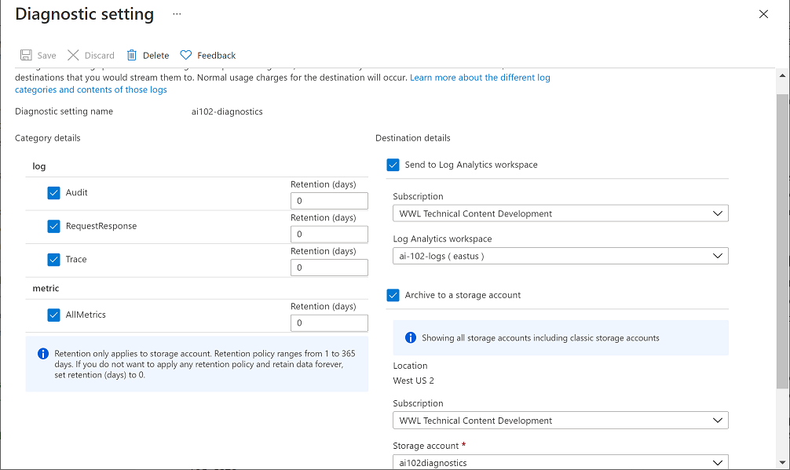
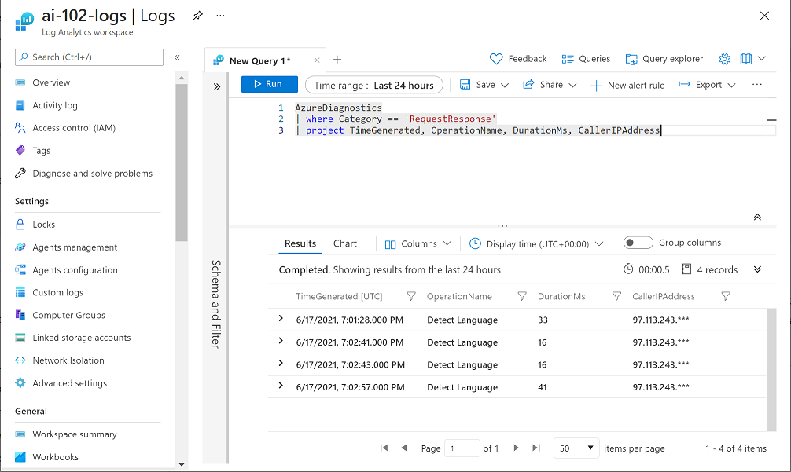

# Monitor Azure AI Services
Like any software service, you must monitor Azure AI Services to track costs, view utilization metrics, and detect potential issues.

## Monitor Costs
Before deploying any services, you may want to estimate the costs by using the [Azure Pricing Calculator](https://azure.microsoft.com/en-us/pricing/calculator/).

After entering the specs you plan to use, the calculator will let you download your estimate in Excel format.

### View Costs
Viewing costs for Azure AI Services is like any other Azure resource: in the Azure Portal, select your subscription and in the Cost Analysis tab you'll see the total spend for that subscription. 

To view only the Azure AI Services costs, add a filter to show only Azure AI Services.

## Alerts
Azure allows for the creation of alerts based on resource metrics or events. These alerts can be configured so the correct team is notified when the alert arises.

### Alert Rules
To add an alert rule for Azure AI Services, select the resource and in the Alerts tab, add a new alert rule.

You must provide the following information:
- Scope
    - The resource for which you want to receive alerts
- Condition
    - When the alert will trigger
    - Triggers are based on one of two types:
        - Activity Log
        - Metric
- Optional Actions
    - Sending an email, running Azure Logic Apps, etc.
- Alert Rule Details
    - Alert rule name, resource group, etc.

## Metrics
Azure resource metrics are collected at regular intervals so you can monitor the service's utilization, performance, and health.

The exact metrics collected depends on the resource, but for Azure AI Services, Azure Monitor collects metrics for endpoint requests, data submitted and returned, errors, and more.

## Diagnostic Logging
Diagnostic logging allows you to capture operational data for Azure AI Services, which can then be used to troubleshoot problems.

### Resources for Diagnostic Log Storage
The log data must be stored at a particular location.

You may choose to use Azure Event Hubs, so you can forward your data to a custom telemetry solution or connect directly to a third party.

Most common is to use one (or both) of these resources:
- Azure Log Analytics
    - Query and visualize log data within the Azure Portal
- Azure Storage
    - Cloud-based data store that can store log archives, which can be exported for use in other tools

These resources should be created <em>before</em> configuring diagnostic logging for your AI services. If you are using Azure Storage, the storage account should be in the same region as the AI Services resource.

### Configure Diagnostic Settings
After readying the destination for your logs, you can begin configuring your Azure AI Services diagnostic settings.

Configuration will happen within the Azure Portal on the Diagnostic Settings page of your Azure AI Services resource. 

Adding diagnostic settings requires you provide:
- A name for the diagnostic setting
- Categories of log event data you will capture
- Destination details for storing logs

Here's an example of Diagnostic Settings enabling Log Analytics and Azure Storage:

### Viewing Logs in Azure Log Analytics
It can take an hour or more for data to being showing in your destinations.

When the data begins to show, you can view it in the Log Analytics resource by running queries like shown here:

## Summary
As part of managing an app using AI Services, you need to understand how to set up proper diagnostic logging to troubleshoot any potential issues.

Azure Log Analytics provides a way for you to query and visualize log data, and Azure Storage lets you store those logs.

The metrics come in handy when you want to set up Alerts, which will notify specific people when a certain metric is passed.

## Further Reading
### [Lab - Monitor Azure AI Services](https://microsoftlearning.github.io/mslearn-ai-services/Instructions/Exercises/03-monitor-ai-services.html)