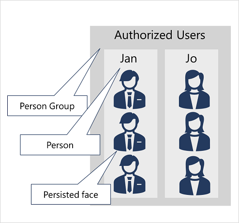

# Detect, Analyze, and Recognize Faces

Face detection, analysis, and recognition are common AI computer vision challenges.

## Options for Face Detection, Analysis, and Identification

Microsoft provides two services in Azure that can be used to build face/people detection in images:
- Azure AI Vision service
    - Detect people and return a bounding box for its location
- Face service
    - More comprehensive facial analysis compared to Azure AI Vision service
    - Includes face detection with bounding boxing, plus:
        - Facial feature analysis (head pose, presence of spectacles, blur, facial landmarks, occlusion, and more)
        - Face comparison and verification
        - Facial recognition

Using facial recognition, identification, comparison, and verification requires getting approved through a [Limited Access policy](https://learn.microsoft.com/en-us/azure/ai-services/cognitive-services-limited-access).

## Considerations for Face Analysis
Building any AI system requires ethical consideration, but AI systems using facial data require special deliberation, such as:
- Data privacy and security
- Transparency
- Fairness and inclusiveness

## Detect Faces with the Azure AI Vision service
Detecting and analyzing faces with the Azure AI Vision service starts with calling the Analyze Image function (SDK or equivalent REST method), specifying People as one of the visual features to return.

A response for an image that contains one or more people may look like this:
```
{ 
  "modelVersion": "2023-10-01",
  "metadata": {
    "width": 400,
    "height": 600
  },
  "peopleResult": {
    "values": [
      {
        "boundingBox": {
          "x": 0,
          "y": 56,
          "w": 101,
          "h": 189
        },
        "confidence": 0.9474349617958069
      },
      {
        "boundingBox": {
          "x": 402,
          "y": 96,
          "w": 124,
          "h": 156
        },
        "confidence": 0.9310565276194865
      },
    ...
    ]
  }
}
```

Notice that it also includes the location of the person/people in the image.

## Capabilities of the Face Service
The Face service provides comprehensive facial detection, analysis, and recognition capabilities.

Face service provides functionality that you can use for:
- Face detection
    - Each detected face returns an identification for the face and bounding box coordinates for its location within the image.
- Face attribute analysis
    - Head pose (pitch, roll, yaw orientation in 3D space)
    - Glasses
    - Blur
    - Exposure
    - Visual noise in the image
    - Occlusion
    - Accessories
    - QualityForRecognition (low, medium, high)
- Facial landmark location
    - Coordinates for key landmarks in relation to facial features (eye corners, pupils, nose tip, etc.)
- Face comparison
    - Find similarities in multiple faces or verify two images contain the same face
- Facial recognition
    - Supply a collection of faces belonging to specific people and train the model to identify those people in new images
- Facial liveness
    - Liveness can be used to determine if the video input is a real stream or fake, so as to prevent spoofing the recognition system

The Face service can be provisioned as a single-service resource or you can use the Face API in a multi-service Azure AI Services resource.

## Compare and Match Detected Face
When a face is detected by the Face service, a unique ID is assigned to it and retained in the service for 24 Hours. The ID is a GUID with no indication of the person's identity other than their facial features.

While the detected face ID is cached, subsequent images can be used to compare the new faces to the cached identity and determine if they are similar (in terms of facial features) or to verify that the same person appears in two images.

The ability to compare faces anonymously can be useful in systems where it's important to confirm the same person is present on two occasions, without the need to know the actual identity of the person. 

For example, someone may want to verify that everyone who enters a secured space also leaves that space.

## Implement Facial Recognition
Training a facial recognition model with the Face service requires these steps:
1. Create a person group that defines the set of individuals you want to identify (for example, Authorized Users)
2. Add a person to the person group for each individual you want to identify
3. Add detected faces from multiple images to each person, ideally in various poses (example image below). The IDs of these faces will no longer expire after 24 hours, so they are referred to as persisted faces

4. Train the model

The trained model is stored in your Face/Azure AI Services resource (whichever you chose) and can be used by client applications to:
- Identify individuals in images
- Verify identity
- Analyze images to find faces that are similar to a known persisted face

## Summary
Your options for detecting and analyzing faces are Azure AI Vision service and the Face service.

The Face service is a more comprehensive choice because it has more capabilities beyond Azure AI Vision, which really only detects faces and their location within an image.

The Face service works by detecting a face and assigning the face a GUID, which is retained in the service for 24 hours. This ensures there is no indication of the person's identity other than their facial features.

## Further Reading
### [Lab - Detect and Analyze Faces](https://microsoftlearning.github.io/mslearn-ai-vision/Instructions/Exercises/04-face-service.html)