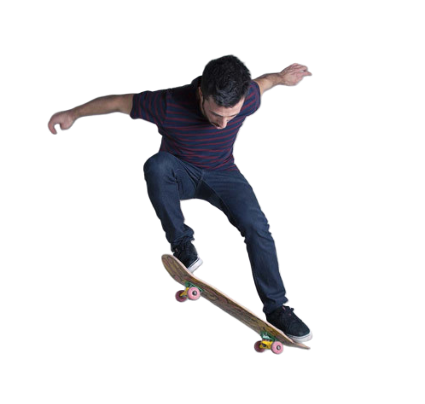

# Analyze Images
Azure AI Vision helps you extract information from image inputs, such as:
- Descriptions and tags
    - Generate a caption and relevant tags that can be used to indicate the subject
- Object detection
    - Detect the presence and location of specific objects within the image
- People detection
    - Detect the presence, location, and features of people in the image
- Image metadata, color, and type analysis
- Category identification
    - Determine an appropriate category for the image and whether or not the image has any landmarks
- Background removal
- Moderation rating
    - Determine if the image has any adult/harmful content
- Optical Character Recognition (OCR)
    - Reading text in an image
- Smart thumbnail generation
    - Identifying the main region of interest in an image and creating a smaller thumbnail version

Azure AI Vision can be provisioned as a single-service resource or in the multi-service Azure AI Services resource.

## Analyze an Image
Use the Analyze Image REST method (or the equivalent in your chosen SDK) and it will return a JSON document with the requested information.

Be sure to specify the visual features you want to include in the analysis, and if you select categories you'll need to choose whether or not you want to identify celebrities or landmarks.

In the ```VisualFeatures``` enum are the different features you can select:
- VisualFeatures.TAGS
    - Identifies image tags
- VisualFeatures.OBJECTS
    - Returns the bounding box for each detected object
- VisualFeatures.CAPTION
    - Generate a caption for the image
- VisualFeatures.DENSE_CAPTIONS
    - Generate more detailed captions for the objects detected
- VisualFeatures.PEOPLE
    - Returns a bounding box for the detected people
- VisualFeatures.SMART_CROPS
    - Returns a bounding box of the specified aspect raion for the area of interest
- VisualFeatures.READ
    - Extract readable text

Python example:
```
from azure.ai.vision.imageanalysis import ImageAnalysisClient
from azure.ai.vision.imageanalysis.models import VisualFeatures
from azure.core.credentials import AzureKeyCredential

client = ImageAnalysisClient(
    endpoint=os.environ["ENDPOINT"],
    credential=AzureKeyCredential(os.environ["KEY"])
)

result = client.analyze(
    image_url="<url>",
    visual_features=[VisualFeatures.CAPTION, VisualFeatures.READ],
    gender_neutral_caption=True,
    language="en",
)
```

The visual features you pick will determine what information is included in the response. Most responses will include a bounding box (if a location in the image is reasonable) or a confidence score (for features such as tags or captions).

Example resonse:
```
{
  "apim-request-id": "abcde-1234-5678-9012-f1g2h3i4j5k6",
  "modelVersion": "<version>",
  "denseCaptionsResult": {
    "values": [
      {
        "text": "a house in the woods",
        "confidence": 0.7055229544639587,
        "boundingBox": {
          "x": 0,
          "y": 0,
          "w": 640,
          "h": 640
        }
      },
      {
        "text": "a trailer with a door and windows",
        "confidence": 0.6675070524215698,
        "boundingBox": {
          "x": 214,
          "y": 434,
          "w": 154,
          "h": 108
        }
      }
    ]
  },
  "metadata": {
    "width": 640,
    "height": 640
  }
}
```

## Smart-Cropped Thumbnails and Background Removal
Creating a thumbnail with AI can return your image with different dimensions (and aspect ratio) from the source image. You can also choose for the image analysis to determine the region of interest (the main subject) in the image, which will be the main focus of the thumbnail.

You can specify the aspect ratio of the newly cropped image (width / height) with a range of 0.75 to 1.80.

### Remove an Image Background
Background removal (as done by Azure AI Vision) is achieved by creating an alpha matte of the foreground subject, at which point either the foreground or background can be returned. When the background is removed, the background is simply transparent.

Alpha mattes are useful when you intend to process the image further.

Original image:<br>


<br>

Alpha matte:<br>


Background removed:<br>


## Summary
Azure AI Vision is used to extract information from images.

Information that can be gathered includes (but is not limited to):
- Relevant description and tags
- People identifier
- Background removal
- OCR

When making a request (whether through REST or SDK) to the Vision service, you must include which VisualFeatures to return. This will determine what information is extracted from the image.

## Further Reading
### [Lab - Analyze Images with Azure AI Vision](https://microsoftlearning.github.io/mslearn-ai-vision/Instructions/Exercises/01-analyze-images.html)