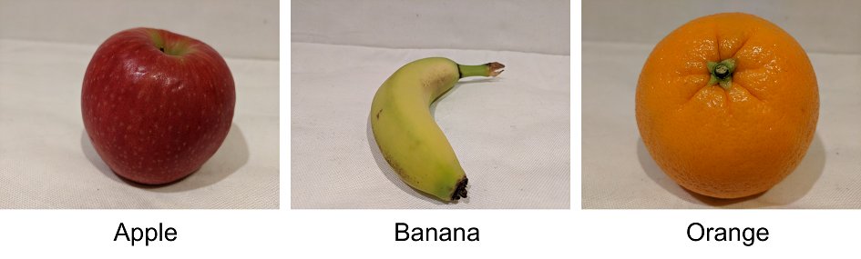

# Classify Images
Image classification refers to software analyzing an image and categorizing (or classifying) it.

Azure AI Custom Vision service allows you to build your own computer vision models for image classification.

## Provision Resources for Custom Vision
Azure AI Custom Vision is a service which allows you to build your own computer visison models for image classification or object detection.

Custom Vision solutions involves two tasks:
1. Use existing labeled images to train an Azure AI Custom Vision model
2. Create a client application that sends new images to your model for inferencing

To use the Azure AI Custom Vision service, you need two kinds of Azure resources:
1. A training resource (pick one from below)
    - Azure AI Services multi-service resource
    - Azure AI Custom Vision (Training) resource
2. A predicition resource
    - Azure AI Service multi-service resource
    - Azure AI Custom Vision (Prediction) resource

You can use an Azure AI Services multi-service resource for both training and prediction. You may also choose to combine resources, like using a Custom Vision (Training) resource to train a model that is published with an AI Services multi-service resource.

When using an Azure AI Services multi-service resource, the endpoint and key is the same for both training and prediction.

## Understand Image Classification
Image classification is a computer vision technique in which the model predicts a class label for an image based on the image's main subject.

In this example, the images have been classified based on the type of fruit in the picture.

Models can be trained for two kinds of classification:
1. Multiclass classification
    - There are multiple classes but each image can belong to only one class
2. Multilabel classification
    - An image can be associated with multiple labels

## Training an Image Classifier
To train an image classification model with the Azure AI Custom Vision service, you can use:
- Azure AI Custom Vision portal
- Azure AI Custom Vision API or SDK
- A combination of the above

These options have the same functionality, but the REST API and SDK options enable you to perform the tasks through code, which can be useful for automation and DevOps integration.

## Summary
Microsoft provides Azure AI Custom Vision which allows you to train and deploy custom models used for computer vision applications. 

You can train the models through the Azure AI Custom Vision Portal or through the AI Custom Vision API & SDK.

## Further Reading
### [Lab - Classify Images with Azure AI Custom Vision](https://microsoftlearning.github.io/mslearn-ai-vision/Instructions/Exercises/07-custom-vision-image-classification.html)