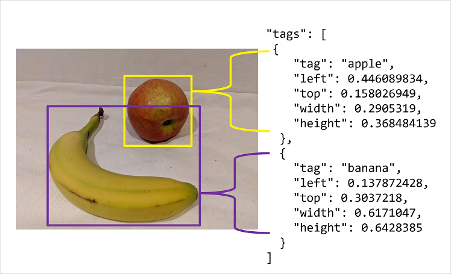

# Detect Objects in Images
Object detection is used to locate and identify objects in images.

Azure AI Custom Vision lets you train models to detect specific classes of objects in pictures.

## Understand Object Detection
Object detection is a form of computer vision in which a model is trained to detect the presence and location of one or more classes of object in an image.

There are two components to an object detection prediction:
- Class label of each object detected
    - For example, the model may detect an image contains one apple and two oranges
- Location of each object within in the image
    - This is usually indicated by a bounding box around each object

## Training an Object Detector
Training an object detection model is done through the same methods as image classification models. However, the most significant difference lies in the labeling of the images.

When labeling an image classification model, tags apply to the entire image. For object detection, you must provide a tag and a region to which the tag applies.

The Azure AI Custom Vision portal provides a GUI for you to label your image and define regions.

## Labeling Images
The Azure AI Custom Vision portal can automatically suggest regions that contain objects, to which you can assign tags or adjust the bounding box around the object. 

After tagging the initial batch of images and training the model, subsequent labeling of new images can use the <em>smart labeler</em> tool in the portal, which suggest regions and classes of the object in the image.

You may also choose to use labeling tools like the one in Azure Machine Learning Studio or the Microsoft Visual Object Tagging Tool (VOTT), which can support assigning image labeling tasks to different team members.

### Bounding Box Measurement Units
If you choose a labeling tool other than Azure AI Custom Vision portal, you may need to adjust the output to match the measurement units expected by the Azure AI Custom Vision API.

Bounding boxes are defined by four values that represent the left (x) and top (y) coordinates of the top-left corner of the bounding box, and the width and height of the bounding box.

These values are expressed as <em>proportional</em> values relative to the source image size. For example:
- Left: 0.1
    - The <em>left of the box</em> is located 0.1 (one tenth) from the <em>left edge of the image</em>
- Top: 0.5
    - The top of the box is 0.5 (half of the image height) from the top of the image
- Width: 0.5
    - The width of the box is 0.5 (half) that of the image
- Height: 0.25
    - The height is 0.25 (a quarter) of that of the image height

Here is another example presenting the values in JSON format: 

## Summary
Summary

## Further Reading
### [Lab - Detect Objects in Images with Azure AI Custom Vision](https://microsoftlearning.github.io/mslearn-ai-vision/Instructions/Exercises/03-custom-vision-object-detection.html)