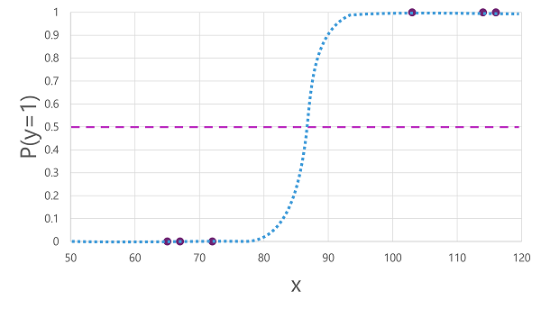
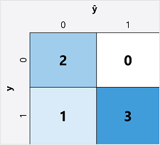

# Fundamentals of Machine Learning

Machine learning traces its origins back to statistics and mathematical data modeling. The idea is that you can use past data to predict unknown values.

## Machine Learning as a Function

A machine learning model is, in essence, a software application holding a mathematic function which will calculate an output value based on a number of inputs.

The process of defining that mathematical function is called <strong>training</strong>.

After the function is defined, you can predict new values with a process known as <strong>inferencing</strong>.

## Steps of Training and Inferencing

1. Training data is composed of past observations.
    - These observations include the observed attributes, which are called <strong>features</strong>.
    - Also included in the data are the <strong>labels</strong>, which are the known values of what you want the model to predict.
    - Example: You want a model to predict pizza sales on a given day.
        - The features would include attributes of the day, like temperature, rainfall, month, etc.
        - The labels would be the number of pizzas sold each day.
    - In math terms, features are often given the variable name <em>x</em> and the labels are given the variable <em>y</em>.
        - There are usually multiple features, so <em>x</em> is a vector.
            - [x1, x2, x3, ...]

2. An algorithm is applied to the data to try and determine a relationship between the features and the label, expressing the relationship as a calculation that can be performed on <em>x</em> to calculate <em>y</em>.
    - The algorithm used will depend on the kind of predictive problem you're trying to solve.

3. The result of the algorithm is a model, which is the function that the algorithm calculated.
    - The function is typically named <em>f</em>.
    - <em>y</em> = <em>f</em>(<em>x</em>)
        - <em>x</em> is fed to the function (the model) to calculate <em>y</em>.

4. Now that steps 1 - 3 (the training) are done, the model can be used for inferencing.
    - The output from the model is a prediction, not an observed value.
        - To make this clear, outputs from the function/model are shown as <em>ŷ</em>, which is pronounced y-hat.

## Types of Machine Learning

- Machine Learning
    - Supervised ML
        - Regression
        - Classification
            - Binary Classification
            - Multiclass Classification
    - Unsupervised ML
        - Clustering

### Supervised Machine Learning

Supervised machine learning is the term for ML algorithms that were trained on data that has both features and known label values.

#### Regression
Regression is a form of supervised ML in which the predicted label is a numeric value.

#### Classification

Classification is a type of supervised machine learning where the label represents a category/class. The two most common types of classification scenarios are:

- Binary Classification
    - The model predicts one of two mutually exclusive outcomes.
        - Example: A model predicts if a patient is or isn't at risk for diabetes.
- Multiclass Classification
    -  The model can predict labels that fall into one of several classes.
        - Example: The model predicts the genre of a movie (action, adventure, comedy, etc.)
    - Sometimes there are multilabel classification models for when the outcome can belong to multiple classes.
        - Example: A movie might be both an action movie and a comedy.

### Unsupervised Machine Learning

Machine learning is considered unsupervised when the training data consists only of feature values; no labels are in the training data. The algorithm then tries to determine a relationship between the feautres.

#### Clustering

Clustering is a form of unsupervised machine learning in which the algorithm identifies similarities between the observed features and groups them into discrete clusters.

A good example is grouping cars into categories based on the size, shape, number of doors, etc. 

Clustering is similar to multiclass classification because they both sort observations into groups. But the difference is that multiclass classification knows the observed labels for the features, so the algorithm can determine a relationship between those features and labels.

Clustering has no known labels, so it must figure out a relationship between the similarities of the observed features.

You may combine clustering and classification. For example, you could use clustering to sort customers into groups based on their similarities, then label the output data and feed it into a classification model which can predict to what group a new customer will belong.

## Regression and Supervised Model Training

Regression and all other supervised ML models are trained through multiple iterations of applying an algorithm, evaluating its performance, and refining the model with different algorithms and parameters.

Here are the key elements in training a supervised machine learning model:
1. Randomly split the training data
    - This is so you can use one subset of data to train the model and the other to evaluate its performance.
2. Use an algorithm to fit the training data to a model
    - For a regression model, you would use a regression algorithm like Linear Regression.
3. Use the validation data from step 1 to test the model by getting it to predict the labels from the features.
4. Compare the known labels in the validation dataset to the labels predicted by the model. Aggregate the differences between the predicted and actual label values to calculate a metric that indicated the model's accuracy.

This process may be referred to as "train, validate, evaluate".

### Regression Evaluation

When you are ready to evaluate the performance of a regression model, you can use these metrics to quantify the models performance.

We will use this example for explaning the metrics: I want my model to predict how many ice creams I will sell each day (label, y) based on the temperature outside (feature, x).

- Mean Absolute Error (MAE)
    - By how many units (ice creams, in our example) the model was wrong.
    - If the prediction was 3 ice creams <em>more</em> than reality, <em>the absolute error is 3</em>.
    - The absolute error would still be 3 if the prediction was 3 ice creams <em>less</em> than reality.
    - The average absolute error of the whole validation set is the Mean Absolute Error.

- Mean Squared Error (MSE)
    - While the MAE takes all errors into account equally, despite the fact that it is sometimes better to have a model that is consistently wrong by a small amount, rather than a model that makes fewer (but larger) errors.
    - Squaring the individual errors can "amplify" them, and we can then calculate the average of the squared errors, which gives us the Mean Squared Error.

- Root Mean Squared Error (RMSE)
    - The issue with the Mean Squared Error is that it no longer shows the number of ice creams we actually sold. It only represents the degree of its incorrectness.
    - If we calculate the square root of the MSE, we get a measurement of the errors in terms of the number of ice creams.

- Coefficient of Determination (R2)
    - In real life, there is some natural variance in the number of daily ice cream sales.
    - The Coefficient of Determination (R-squared) measures the proportion of variance in the results that can be explained by the model, versus some anomaly in the data.
        - An anomaly could just be something like a local festival causing increased ice cream sales on a particular day.
    - The Coefficient of Determination compares the sum of squared differences between the predicted and actual labels with the sum of squared differences between the actual label values and the mean of the actual label values.
        - It looks like this:
        - <em>R2 = 1 - ∑(y-ŷ)2 / ∑(y-ȳ)2</em>
    - It is important to understand that the <strong>main idea</strong> is that it returns a value between 0 and 1 that describes the proportion of variance that can be explained by the model.
        - The closer the value is to 1, the better the model is at fitting the validation data.

### Iterative Training

In real-world scenarios, data scientists will use an iterative process to train and evaluate a model:
- Select the proper features
- Pick the best algorithm
- Configure hyperparameters
    - Hyperparameters are other (not x or y) parameters that affect algorithm behavior.

## Binary Classification

Classification is a supervised machine learning technique, which means it follow s the same iterative process of training, validating, and evaluating models.

Regression models predict various numeric values, but classification models predict probability values for class assignment (which is still technically numeric, but you will see the difference shortly).

Example: you want to train an AI to predict if a patient is diabetic. The label is either 1 or 0, representing true or false.

1. We use an algorithm to fit the training data to a function which outputs the probability of the label being true.
    - Probability is measured between 0 and 1. 
    - This value accounts for the total probability for all possible classes.
        - Example: a probability of 0.7 indicates there is also a probability of 0.3 that the patient is NOT diabetic.
    - Many algorithms can be used for binary classification, including <em>logistic regression</em>.
        - Make sure to remember this is for classification, not for regression!
        - This is a graph for Logistic Regression: 
            - This graph (provided by Microsoft) also shows the <em>threshold</em>, which is the point when the model will predict 1 or 0, true or false.
            - The threshold for our example, as shown in the graph, is <strong>0.5</strong>.

2. We evaluate the performance of a Binary Classification model the same way we did with regression training: using the evaluation data that was not fed to the model.

3. Comparing the actual vs predicted values is usually done through a <em>confusion matrix</em> that displays the number of correct and incorrect predictions for both possible classes.
    - Example provided by Microsoft: 
        - This example shows the model gave:
            - 2 <em>True Negatives</em>
            - 0 <em>False Positives</em>
            - 1 <em>False Negative</em>
            - 3 <em>True Positives</em>
        - The example also shows that the <em>true</em> predictions are together in a diagonal line from top-left to bottom-right.
        - The <em>true</em> predictions are also shaded blue, with the higher intensity blue being assigned to the higher number.
            - This is so that, at a glance, you can tell how good or bad the model did.
            - A model that performed well should have a deeply colored diagonal trend.

4. Accuracy refers to the proportion of predictions the model got right. 
    - Accuracy = (TN + TP) / (TN + FN + TP + FP)
    - In the example above, the result is: (2 + 3) / (2 + 1 + 3 + 0) = <strong>0.83</strong>
    - This means that the model predicted correctly 83% of the time.

    While accuracy might seem like a good metric to use on its own, it does have limitations. Consider this:

    - If 11% of the population has diabetes, the model that always predicts '0' (no diabetes) would be correct 89% of the time.

    This means the model is not truly useful because it fails to diagnose any true positive cases and also fails to differentiate between patients based on their features.

5. Recall (or <em>True Positive Rate</em>) is a metric that can resolve our issues with the Accuracy metric.
    - Of all the positive cases, how many did the model correctly predict?
    - Recall = TP / (TP + FN)
    - From our example: 3 / (3 + 1) = <strong>0.75</strong>
    - So of the patients who actually have diabetes, the model predicted 75% of them as having diabetes.

6. Precision is like Recall, but reversed: what proportion of positive predictions are correct?
    - Precision = TP / (TP + FP)
    - Example: 3 / (3 + 0) = <strong>1.0</strong>
    - 100% of patients predicted to have diabetes actually have diabetes.

7. F1-Score is a metric that combines Recall and Precision.
    - F1-Score = (2 x Precision x Recall) / (Precision + Recall)
    - Our example: (2 x 1.0 x 0.75) / (1.0 + 0.75) = <strong>0.86</strong>
    - The F1-Score is basically an averaging of values that weights Precision and Recall in a balanced way, since both need to increase in value for the F1-Score to increase.

8. Area Under the Curve (AUC) is used to determine how much better the model is at predicting versus random guesses.
    - Like the True Positive Rate (TPR) there is also a False Positive Rate (FPR).
        - FPR = FP / (FP + TN)
        - FPR = 0 / (0 + 2) = <strong>0</strong>
    - We know the TPR for our model (when the threshold is 0.5) is 0.75.

    If we were to change the threshold value, the number of positive and negative predictions would also change, which then changes the TPR and FPR metrics. 

    These metrics are often used to plot a <em>Received Operator Characteristic (ROC)</em> curve that compares the TPR and FPR for every possible threshold value between 0.0 and 1.0.

    

    A perfect model would produce an ROC curve that goes straight up the TPR axis and then straight across the FPR axis. With the plot area measuring 1x1, the area under the curve would be 1.0, which indicates a model being correct 100% of the time.

    The graph shows a line going diagonally from the bottom left to the top right. If that was our model's ROC curve, it would have an AUC of 0.5, indicating our model is correct 50% of the time, which is equivalent to randomly guessing.

    The solid purple curve in the graph is the ROC curve of our example, and it has an AUC of <strong>0.875</strong>.

    ## Multiclass Classification

    We use multiclass classification to predict which of multiple possible classes something belongs to.

    Example: we want to classify penguins into species <em>(y)</em> by flipper length <em>(x)</em>. 
    
    Here are our possible classes:

    0. Adelie
    1. Gentoo
    3. Chinstrap

    Flipper length (observed):
    - 167
    - 172
    - 225
    - 197
    - 189
    - 232
    - 158

    ### Training a Multiclass Classification Model

    Algorithms for multiclass classification calculate a probability value for each possible class. Here are two common types of algorithms:
    - One vs Rest (OvR) algorithms
    - Multinomal algorithms

    ### One vs Rest (OvR)

    OvR algorithms train a binary classification function for each class. Each function basically compares the probability of the observation being a specific class compared to any other class. This results in the algorithm predicting a class for the function that produces the highest probability.

    ### Multinomal algorithms