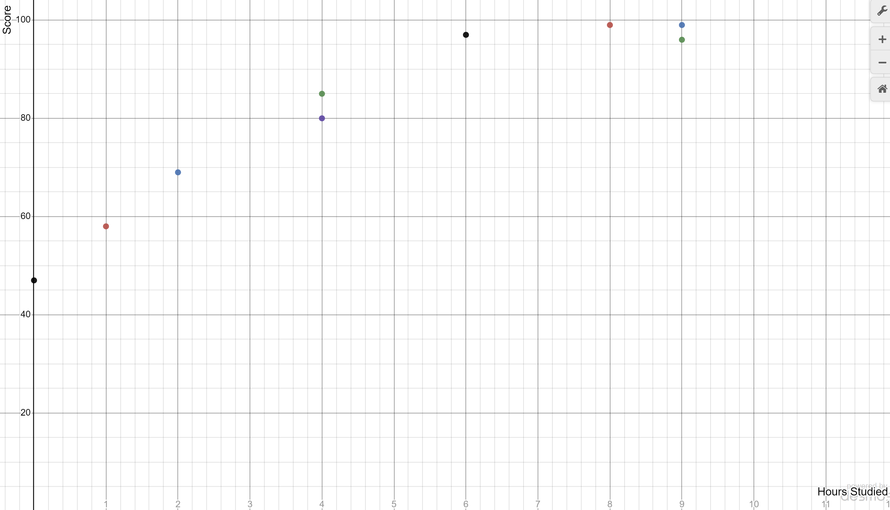
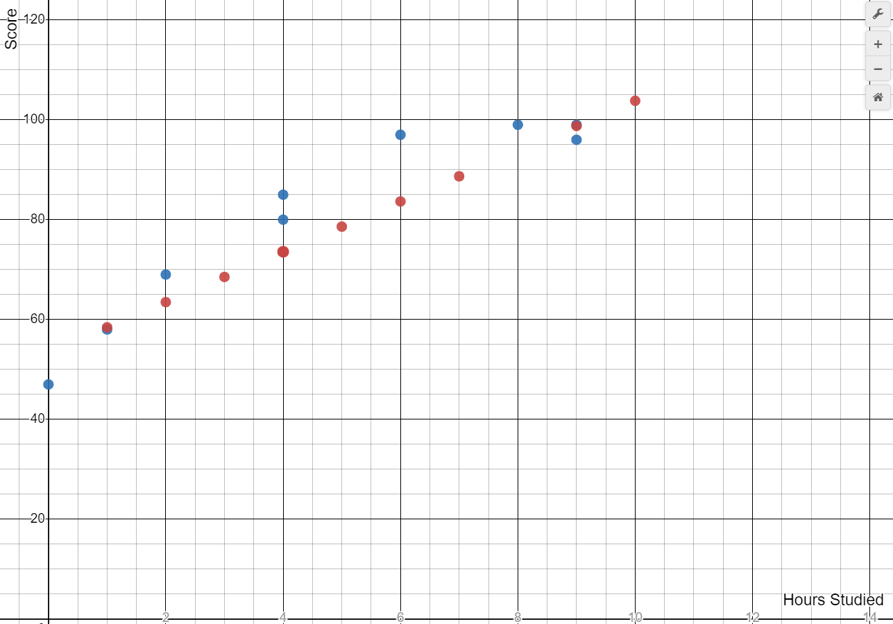

# Regression Calculation Example

Refer to [the glossary]([AI-900]%200.%20Glossary.md).

We want to predict how well a student will perform on a test based on the hours they spent studying.

Here is data that (in a real-world scenario) would be gathered from actual study times and test scores.

#### Hours Spent Studying (x), Test Score (y)
0, 47 
1, 58 
1, 60 
2, 69 
2, 65 
3, 76 
4, 85 
4, 80 
4, 89 
5, 97 
5, 96 
6, 97 
6, 98 
7, 100 
8, 99 
9, 98 
9, 99 
9, 96 
10, 100 

## 1. Data Split and Graphing

We first split the data into two parts: a training part and evaluation part.

#### Training:

0, 47 
1, 58 
2, 69 
4, 85 
4, 80 
6, 97 
8, 99 
9, 99 
9, 96 

#### Evaluation:
1, 60 
2, 65 
3, 76 
4, 89 
5, 97 
5, 96 
6, 98 
7, 100 
9, 98 
10, 100 

Using the training data, we can plot the results to get an idea of how the values relate to each other.

## 2. Training - Apply an ML Algorithm

For this very basic example, we will apply Linear Regression, which is a statistic model that can estimate a linear relationship between our features and labels.

Linear regression can follow this formula: <em>y = mx + b</em>

Let's say the algorithm returned this function, which is our model: <em>y = 5.04x + 53.4</em>

## 3. Testing the Model

Now is the time for us to use our evaluation data to test our model.

#### Model:
<em>y = 5.04x + 53.4</em>

#### Evaluation Data:
(x, y) 
1, 60 
2, 65 
3, 76 
4, 89 
5, 97 
5, 96 
6, 98 
7, 100 
9, 98 
10, 100 

#### Expected Result:
<em>60 = 5.04(1) + 53.4</em> 
<em>65 = 5.04(2) + 53.4</em> 
<em>76 = 5.04(3) + 53.4</em> 
<em>89 = 5.04(4) + 53.4</em> 
<em>97 = 5.04(5) + 53.4</em> 
<em>96 = 5.04(5) + 53.4</em> 
<em>98 = 5.04(6) + 53.4</em> 
<em>100 = 5.04(7) + 53.4</em> 
<em>98 = 5.04(9) + 53.4</em> 
<em>100 = 5.04(10) + 53.4</em> 

#### Predicted Result (<em>ŷ</em>):
<em><strong>58.44</strong> = 5.04(1) + 53.4</em> 
<em><strong>63.48</strong> = 5.04(2) + 53.4</em> 
<em><strong>68.52</strong> = 5.04(3) + 53.4</em> 
<em><strong>73.56</strong> = 5.04(4) + 53.4</em> 
<em><strong>78.6</strong> = 5.04(5) + 53.4</em> 
<em><strong>78.6</strong> = 5.04(5) + 53.4</em> 
<em><strong>83.64</strong> = 5.04(6) + 53.4</em> 
<em><strong>88.68</strong> = 5.04(7) + 53.4</em> 
<em><strong>98.76</strong> = 5.04(9) + 53.4</em> 
<em><strong>103.8</strong> = 5.04(10) + 53.4</em> 

We can plot our results for a different view of the data.

Red is the predicted value, while blue is the training (known) data.

We can see that the predicted values fall directly on the function line, which led to some big differences in the predicted vs actual data.

## 4. Evaluating the Model

### Mean Absolute Error (MAE)

First, we need to get the absolute error of each prediction. This means we need to calculate by how many points each prediction was wrong. 

This is done by subtracting the predicted result from the actual result. The AE/MAE is always shown as a positive number, regardless if the difference between the two is positive or negative.

- x = 1:
    - Predicted: 58.44
    - Actual: 60
    - Absolute Error: 1.56

- x = 2:
    - Predicted: 63.48
    - Actual: 65
    - Absolute Error: 1.52

- x = 3:
    - Predicted: 68.52
    - Actual: 76
    - Absolute Error: 7.48

- x = 4:
    - Predicted: 73.56
    - Actual: 89
    - Absolute Error: 15.44

- x = 5:
    - Predicted: 78.6
    - Actual: 97, 96
    - Absolute Error: 18.4, 17.4

- x = 6:
    - Predicted: 83.64
    - Actual: 98
    - Absolute Error: 14.36

- x = 7:
    - Predicted: 88.68
    - Actual: 100
    - Absolute Error: 11.32

- x = 9:
    - Predicted: 98.76
    - Actual: 98
    - Absolute Error: 0.76

- x = 10:
    - Predicted: 103.8
    - Actual: 100
    - Absolute Error: 3.8

Now we can average the Absolute Errors to get the Mean Absolute Error.

The result is: <strong>9.204</strong>

### Mean Squared Error (MSE)

To amplify the effects of errors that are larger, we can square all the Absolute Errors and then find the average.

The result is: <strong>128.97776</strong>

### Root Mean Squared Error (RMSE)

When we squared the AEs, it meant that we no longer had an accurate number telling us by how many points the scores were off. We can fix this by taking the square root of the MSE.

The result is: <strong>11.35683758799077</strong>

### Coefficient of Determination (R2)

While the previous metrics show differences between predicted and actual values, the Coefficient of Determination lets us see the amount of variance that can be explained by the model, rather than variance that is just some abnormal occurrence.

Here is the formula for the Coefficient of Determination: <em>R2 = 1 - ∑(yi-ŷi)2 / ∑(yi-ȳ)2</em>

Let's break down what these Y variables mean:
- yi
    - The actual (observed) label in the evaluation data
- ŷi
    - Predicted label
- ȳ
    - The mean of the observed Y values
- The little i
    - This represents a single iteration of the y variable.

So plugging those values in for all 9 data points of our evaluation dataset, we get:
- yi
    - y1 = 60
    - y2 = 65
    - y3 = 76
    - y4 = 89
    - y5 = 97, 96
    - y6 = 98
    - y7 = 100
    - y8 = 98
    - y9 = 100
- ŷi
    - ŷ1 = 58.44
    - ŷ2 = 63.48
    - ŷ3 = 68.52
    - ŷ4 = 73.56
    - ŷ5 = 78.6
    - ŷ6 = 83.64
    - ŷ7 = 88.68
    - ŷ8 = 98.76
    - ŷ9 = 103.8
- ȳ
    - ȳ = 87.9

An example iteration of the R-Squared calculation (for data point 3) is:
 
 
<em>R2 = 1 - ∑(y3-ŷ3)2 / ∑(y3-ȳ)2</em>
 
 
<em>0.5926 = 1 - ∑(76 - 68.52)2 / ∑(76 - 87.9)2</em>

That is an example of one iteration of the R-Squared calculation. We need to calculate that for each data point (1-9). This can be done with online calculators.

