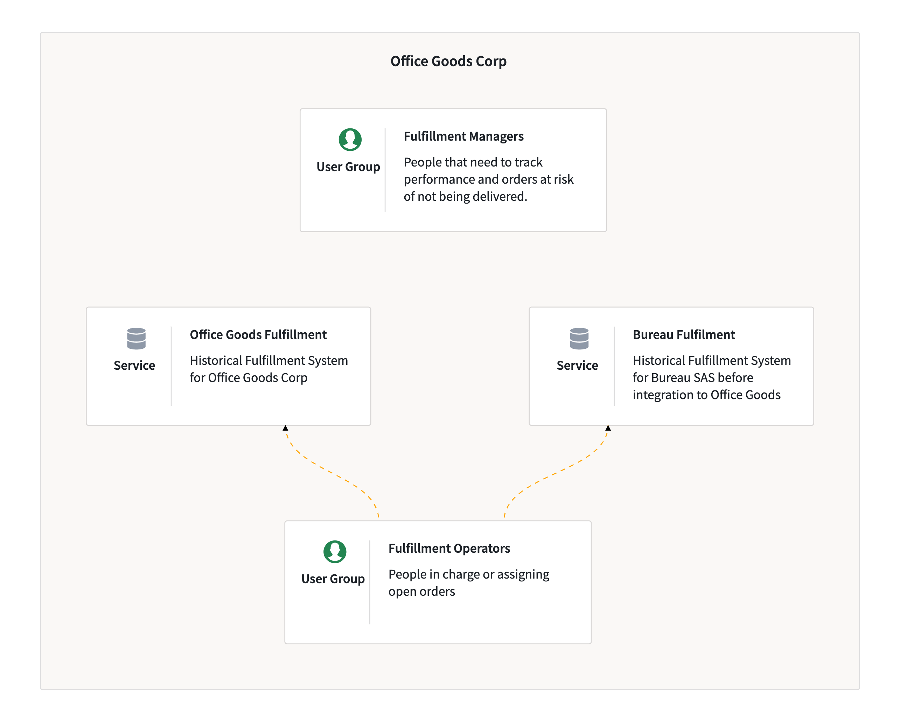
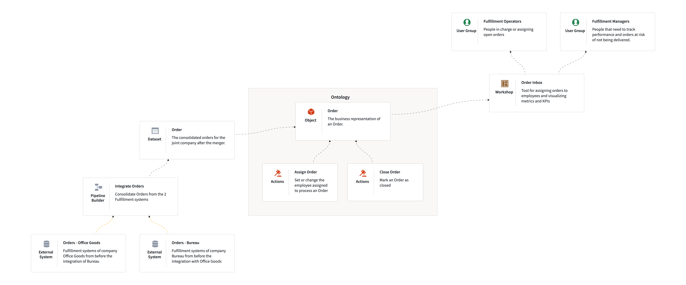

# Palantir Speedrun

## Introduction

You work for Office Goods Corp, a paper and office goods company, which recently acquired Bureau SAS. IT unification won't begin for another year, so your team is stuck managing orders from two different systems.

You decide to create a tool that will connect to both systems and create a single location for managers to assign orders, show what orders haven't been assigned, and what is at risk of not being delivered. This will also ensure there's no debate as to which spreadsheet is most up-to-date.

Here is the architecture diagram you have created for the solution:

> All resources created in Foundry must live inside a Project. In a production environment, these resources are likely shared and so you should create a Project for each stage of the workflow, as noted in the Palantir documentation.